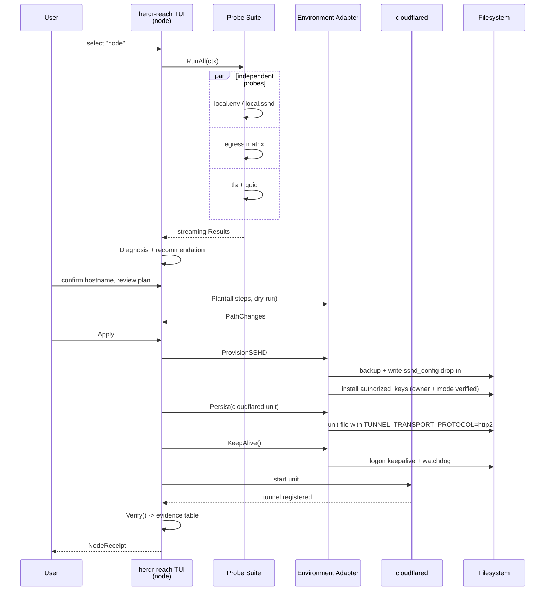
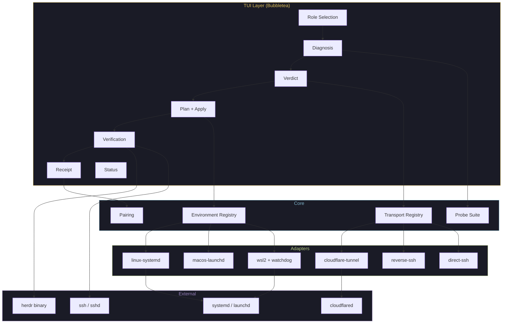

# PRD: Herdr Reach — Make a Locked-Down Machine Reachable to Your Herdr

> **Every Herdr tool assumes SSH already works. This one makes that true.**

**Version**: 0.1.0-draft
**Author**: Luisalt20
**Date**: 2026-09-14
**Status**: Draft
**Upstream**: [Herdr — Connecting machines](https://herdr.dev/docs/connecting-machines/)

---

## 1. Problem Statement

Herdr 0.9 shipped multi-machine: one client, several servers, one sidebar. It works over SSH, and for the machines most of us have at home, it works immediately.

For a large class of machines it does not, and no amount of good software on either end fixes it:

- Corporate laptops behind an endpoint agent (FortiClient, Zscaler, Netskope) that kills VPN adapters and blocks egress by destination
- Machines on ISP CGNAT, carrier NAT, or a network that simply will not allow inbound anything
- A work machine whose outbound SSH is perfectly allowed, but whose egress to *your* server is blocked at the IP level

The people who own these machines are exactly the people who want agents running on them: the work laptop has the company's repos, credentials and VPN access; the cheap VPS has the uptime.

**Today, connecting a locked-down machine to Herdr requires all of this:**

1. Discover that multi-machine needs SSH reachability, that your machine has none, and that the usual answer (Tailscale) is blocked by the endpoint agent.
2. Learn that inbound is hopeless and you need an outbound tunnel — and that the obvious free option (Cloudflare Quick Tunnels) is HTTP-only and cannot carry SSH.
3. Realize an SSH tunnel needs **a domain of your own** in a Cloudflare account. Buy one, or borrow a subdomain and find out that a DNS record is not enough: you need membership in the account that owns the zone.
4. Create a named tunnel, add a published application route with service type SSH, create an Access application, create a service token, and hope the policy action is `Service Auth` and not `Emails`.
5. Discover that `cloudflared access ssh` is reported to ignore service tokens on `2026.6.0` ([#1673](https://github.com/cloudflare/cloudflared/issues/1673), open and single-source), so a headless connection falls into a browser flow that can never complete. Pin the last release the report does not implicate and verify its SHA256 by hand.
6. Discover that the Windows target this tool provisions is WSL2 — Herdr added a Windows server only in 0.9.1, and the provisioning slices do not cover a native Windows node yet — then install and harden an `sshd` inside it.
7. Discover that systemd services do **not** keep a WSL2 instance alive; only children of Microsoft's `/init` do. Build a keepalive.
8. Discover that `vmIdleTimeout` defaults to 60 seconds and is a second, independent shutdown mechanism.
9. Discover that Docker Desktop can take the whole VM down with it, and build a self-healing watchdog because you cannot stop it.
10. Get the key path wrong once (`sudo su` moved `~` to `/root`) and only catch it because you checked fingerprints — the content was right, the location was wrong.
11. Finally run `herdr machine add`.

Each numbered step is an evening lost by a competent developer. The list is not a description of a hard problem; it is a description of **11 undocumented traps**, each of which fails silently and looks like something else.

> **Premise note (2026-09-20).** Step 6 is the one item on this list whose premise has changed since
> it was written: Herdr **0.9.1** (2026-09-16) added Windows SSH hosts, and on a Windows 11 24H2 host
> (build 26100) running 0.9.1, `herdr machine add` saved the connection and the hub listed the agents
> running natively on Windows. The trap was real when it was written. What remains true is this
> tool's limit: `herdr-reach` does not provision a native Windows node yet, so WSL2 is the Windows
> path it provisions. Known limit: the tool does not measure the node's Herdr version, so a node
> running Herdr older than 0.9.1 is classified as supported here although it also cannot host a
> saved-machine connection.

**This is a barrier that shouldn't exist.**

### 1.1 The evidence is measurable, not anecdotal

The trap is that the failure looks like "SSH is blocked". It usually is not. Measured from a locked-down corporate machine on a FortiClient network:

| Target | Port | Result | What it proves |
|---|---|---|---|
| `github.com` | 22 | **OK** | SSH is not blocked as a protocol |
| `ssh.github.com` | 443 | **OK** | SSH-over-443 works when the port is allowed |
| Your VPS | 22, 2222, 443 | **BLOCKED** | The block is on the **destination**, not the protocol |
| `region1.v2.argotunnel.com` | 7844 | **OK** | Cloudflare tunnel egress is allowed |
| `region1.v2.argotunnel.com` | 443 | **OK** | Same, over HTTPS |
| `www.cloudflare.com` | 443 | **OK** | No TLS interception (`issuer = Let's Encrypt/ISRG`, `verify code 0`) |

Read carefully what that table says. Every conclusion a human draws from *"my corporate network blocks SSH"* is wrong. SSH works. The destination is blocked. The tunnel edge is reachable. **The only thing missing was the measurement.**

A Quick Tunnel (`cloudflared tunnel --url http://localhost:8080`) then proved the whole path end to end — TLS, edge registration, a public hostname — **before anyone spent money on a domain.** That is the entire product thesis in one experiment: measure first, decide after.

### 1.2 The ecosystem solves a different layer

Seven projects occupy this space. Every one of them assumes SSH reachability, and none of them establish it:

| Project | Layer it solves | Assumes SSH |
|---|---|---|
| [`stfl/herdr-bridge`](https://github.com/stfl/herdr-bridge) | One remote agent → one local pane | ✅ `ssh host herdr ...` |
| [`ofogelin/herdr-mirror`](https://github.com/ofogelin/herdr-mirror) | Mirror remote workspaces into the local sidebar | ✅ |
| [`Poor-Plebs/herdr-remote-panes`](https://github.com/Poor-Plebs/herdr-remote-panes) | Remote terminals from a menu, read from `~/.ssh/config` | ✅ |
| [`dcolinmorgan/herdr-remote`](https://github.com/dcolinmorgan/herdr-remote) | Human dashboard (menu bar, phone, Telegram) over HTTP | ✅ via `HERDR_REMOTES` |
| [`Tomyail/herdr-connect`](https://github.com/Tomyail/herdr-connect) | LAN companion app for a phone | ✅ same LAN |
| Herdr 0.9 native | Multi-machine | ✅ *"machines need to be reachable over SSH"* |
| **Herdr Cloud** | Connectivity | — **not shipped** |

`dcolinmorgan/herdr-remote` is the closest, and the distance is instructive. It exposes a relay to **a human with a phone**, over HTTP/WebSocket — which is why it can use free Quick Tunnels. Herdr multi-machine needs **raw SSH to a machine**, which Quick Tunnels cannot carry and which therefore needs a named tunnel, a domain, and Access.

**The gap is the reachability layer itself.** `herdr-reach` is that layer.

A pleasant consequence: our output — *"SSH to `workbox` now works, and here is the proof"* — is the literal input every project in that table needs. We do not compete with them; we enable them.

---

## 2. Vision

**A single TUI that takes a locked-down machine and a Herdr install, measures what the network actually allows, provisions the only transport that will work, proves it works, and makes it survive reboots.**

Think of it as **Herdr Cloud, self-hosted, today** — with one deliberate difference. Herdr Cloud will be a service you join. `herdr-reach` is a tool you run, on machines you own, with infrastructure you already have.

Three pillars, in order of importance:

**1. Diagnose before choosing.** The transport is not a preference; it is a consequence of measurement. A probe suite establishes what the network permits, and the tool then recommends with evidence instead of guessing. This is the product, not a feature of it.

**2. Pair out of band, verify with fingerprints.** The two machines cannot reach each other — that is the problem being solved — so the handoff must be an explicit artifact the human carries. And every step emits a verifiable fingerprint, because the failure mode we hit is not "wrong key", it is "right key, wrong place".

**3. Persist self-healing.** A tunnel that dies with the terminal is a demo. A tunnel that survives a reboot, a Docker Desktop quit, and a forced `wsl --shutdown` is a tool.

**Before**: "I want my work laptop's agents in the same Herdr sidebar as my VPS. Herdr needs SSH, the corporate network blocks my VPS, Tailscale is killed by FortiClient, and Cloudflare wants a domain I don't own. I guess I'll read eleven docs and lose a week."

**After**: `herdr-reach` on the laptop → it measures, tells you exactly what is possible, and provisions it. Copy one bundle to the hub. `herdr machine add workbox` works. Done.

### 2.1 Non-goals

These are deliberate, and they are what keep V1 shippable:

- **Not a new transport.** We compose existing, proven ones (Cloudflare Tunnel, plain SSH, reverse SSH). We do not invent a protocol.
- **Not a dashboard.** Viewing your agents from a phone is a solved problem by better-suited projects. We make the machine reachable; they show it.
- **Not an orchestration runtime.** Herdr owns panes, sessions and agents. We never touch them.
- **Not Herdr Cloud.** No hosted service, no account, no backend. Everything runs on the user's machines.
- **Not Herdr-bridge-shaped.** We do not mirror panes or graft workspaces. `herdr machine add` already does multi-machine; we make its prerequisite true.

---

## 3. Target Users

### Primary

- **Developers with a work machine they cannot control.** The company laptop has the repos, the credentials and the VPN. It runs FortiClient or similar. They want agents on it and cannot open a port on it.
- **Developers with a personal hub.** A VPS, a home server, a Mac mini — something that stays awake. They already SSH to it, and they want their work machine in the same Herdr sidebar.
- **Homelab and self-hosting users.** They have infrastructure, they distrust hosted control planes, and they will happily run a TUI that explains itself.

### Secondary

- **People behind CGNAT.** No port forwarding is possible, and no vendor help is coming.
- **Teams with a standardized restricted image.** One person solves it, everyone else needs the same recipe.
- **Ecosystem authors.** Maintainers of the projects in §1.2 who want their tool to work on machines that are not already reachable.

### Explicitly not the target

- Someone with an unrestricted home network and two personal machines. `herdr machine add` already works; adding a tunnel would be a regression.
- Anyone unwilling to own a domain or a hub machine. Without one reachable endpoint, this class of problem has no solution — ours included.

---

## 4. User Experience

### 4.1 Entry Point — Role Selection

`herdr-reach` has no subcommands to memorize. It starts by asking the only question that matters, because the two sides have completely different jobs and almost nothing in common beyond the pairing artifact.

```
┌────────────────────────────────────────────────────────────────────┐
│                                                                    │
│   ╔══════════════════════════════════════╗                         │
│   ║   HERDR REACH                        ║                         │
│   ╚══════════════════════════════════════╝                         │
│                                                                    │
│   Connect a locked-down machine to your Herdr.                     │
│                                                                    │
│   Which machine is this?                                           │
│                                                                    │
│     Hub      Where my Herdr lives, and where the agents            │
│              from the other machine should appear.                 │
│              (a VPS, a home server, a Mac mini)                    │
│                                                                    │
│     Node     The machine that is hard to reach.                    │
│              (a work laptop, anything behind a corporate           │
│              firewall, anything on CGNAT)                          │
│                                                                    │
│   j/k: navigate • enter: select • q: quit                          │
└────────────────────────────────────────────────────────────────────┘
```

The choice is not cosmetic. It selects the entire probe set, the plan, and the provisioning steps:

| | **Hub** | **Node** |
|---|---|---|
| Network | Usually unrestricted — few probes | The interesting one — full probe suite |
| Needs `sshd` | No (it is the client) | Yes |
| Hosts the tunnel | No | Yes |
| Consumes tunnel | Yes | No |
| Persistence | The forwarder service | Tunnel + sshd + **environment keepalive** |
| Registers with Herdr | Yes (`machine add`) | No |
| Emits | `PairingBundle` | `NodeReceipt` |

Naming is a deliberate choice: **hub** is the place where the orchestrator lives, **node** is a machine that joins it. Neither word is overloaded in Herdr's own vocabulary.

### 4.2 Node Flow — The Interesting Side

```
"Node"
   │
   ▼
┌────────────────────────────────────────────────────────────────────┐
│  Step 1: Diagnosing                                                │
│                                                                    │
│  Measuring what this network actually allows.                      │
│  Nothing is installed or changed yet.                              │
│                                                                    │
│  [██████████████░░░░] 70%                                          │
│                                                                    │
│  ✓ Local    Linux, systemd, architecture aarch64                   │
│  ✓ Local    sshd present (not configured)                          │
│  ✓ Egress   SSH to a public host on :22        OK                  │
│  ✓ Egress   SSH to a public host on :443       OK                  │
│  ✗ Egress   SSH to your hub on :22             BLOCKED             │
│  ✗ Egress   SSH to your hub on :443            BLOCKED             │
│  ✓ Egress   Cloudflare edge :7844 (TCP)        OK                  │
│  ✓ Egress   Cloudflare edge :443               OK                  │
│  ✗ Egress   Cloudflare edge :7844 (UDP/QUIC)   BLOCKED             │
│  ✓ TLS      No interception (issuer: ISRG)                         │
│                                                                    │
└──────────────────────────┬─────────────────────────────────────────┘
                           │
                           ▼
┌────────────────────────────────────────────────────────────────────┐
│  Step 2: Verdict                                                   │
│                                                                    │
│  Your outbound SSH works. Your hub is blocked by IP.               │
│  Tailscale adapters are unavailable.                               │
│                                                                    │
│  ⇒ Recommended transport:                                          │
│                                                                    │
│    ★ cloudflare-tunnel          viable                             │
│      Requires: a hostname on a domain in a Cloudflare account      │
│      Notes: QUIC is blocked; HTTP/2 will be forced                 │
│      Notes: cloudflared must be pinned to 2026.5.1 (see §8.2)      │
│                                                                    │
│      reverse-ssh                NOT viable — hub :22 blocked       │
│      direct-ssh                 NOT viable — hub :22 blocked       │
│      tailscale                  NOT viable — adapter blocked       │
│                                                                    │
│  [Continue]  [Re-run probes]  [Show raw evidence]                  │
└──────────────────────────┬─────────────────────────────────────────┘
                           │
                           ▼
┌────────────────────────────────────────────────────────────────────┐
│  Step 3: What needs a human                                        │
│                                                                    │
│  A Cloudflare Tunnel for SSH needs a hostname you control.         │
│  That is the one thing this tool cannot create for you.            │
│                                                                    │
│  ★ I have a hostname ready                                         │
│  ○ Show me what to ask the domain owner for                        │
│                                                                    │
└──────────────────────────┬─────────────────────────────────────────┘
                           │
                           ▼
┌────────────────────────────────────────────────────────────────────┐
│  Step 4: Plan                                                      │
│                                                                    │
│  This will change the following, and nothing else:                 │
│                                                                    │
│  ✓ Install openssh-server                                          │
│  ✓ Harden /etc/ssh/sshd_config.d/99-herdr-reach.conf               │
│      passwordauth no · kbdinteractive no · permitrootlogin no      │
│  ✓ Authorize one dedicated key in ~/.ssh/authorized_keys           │
│  ✓ Install cloudflared 2026.5.1 (SHA256 verified)                  │
│  ✓ Install a systemd unit with TUNNEL_TRANSPORT_PROTOCOL=http2     │
│  ✓ Install environment persistence (§6)                            │
│  ✓ Back up every file before writing it                            │
│                                                                    │
│  [Apply]  [Dry run]  [Back]                                        │
└──────────────────────────┬─────────────────────────────────────────┘
                           │
                           ▼
┌────────────────────────────────────────────────────────────────────┐
│  Step 5: Verifying                                                 │
│                                                                    │
│  ✓ sshd listening on 0.0.0.0:22                                    │
│  ✓ Effective config confirmed via `sshd -T`                        │
│      passwordauthentication no                                     │
│      permitrootlogin no                                            │
│  ✓ Authorized key at /home/user/.ssh/authorized_keys             │
│      owner user:user · mode 600                                │
│  ✓ Key fingerprint SHA256:AbCdEfGhIjKlMn/... matches the hub       │
│  ✓ Tunnel registered (protocol=http2, verified from logs)          │
│  ✓ Persistence unit active and enabled                             │
│                                                                    │
│  [Emit receipt]                                                    │
└──────────────────────────┬─────────────────────────────────────────┘
                           │
                           ▼
┌────────────────────────────────────────────────────────────────────┐
│  Step 6: Receipt                                                   │
│                                                                    │
│  Take this to your hub. It is safe to paste into a chat with       │
│  yourself — it contains one public key and no secrets.             │
│                                                                    │
│  ┌──────────────────────────────────────────────────────────────┐  │
│  │ herdr-reach-receipt/v1                                       │  │
│  │ eyJob3N0bmFtZSI6InNzaC5leGFtcGxlLmNvbSIsImZpbmdlcnByaW50... │  │
│  └──────────────────────────────────────────────────────────────┘  │
│                                                                    │
│  [Copy]  [Show decoded]  [Write to file]                           │
└────────────────────────────────────────────────────────────────────┘
```

> **Slice-scope note (2026-09-19).** The Step 2 mock above shows the product's verdict wording, and slice
> R1a is narrower by design: its QUIC probe sends a raw UDP datagram and never claims that QUIC "works" or
> is "blocked" — silence is reported as unresolved (design D8) — and the transport layer only recommends
> forcing HTTP/2, without claiming it was applied (`specs/transport-feasibility/spec.md`, R-HR-05). Forcing
> it is R5. The `2026-09-19` hand-run did force it on the node and confirmed the override with
> `systemctl show cloudflared -p Environment`; that is an R5 behaviour demonstrated by hand, not a
> capability of this slice.

Note what Step 4 does **not** do: it does not touch anything without showing the plan first, and it never edits a file without backing it up. On a work laptop, a tool that silently rewrites `sshd_config` deserves to be uninstalled.

### 4.3 Hub Flow

```
"Hub"
   │
   ▼
┌────────────────────────────────────────────────────────────────────┐
│  Step 1: Inspecting                                                 │
│                                                                    │
│  ✓ herdr 0.9.0                                                     │
│  ✓ ssh client present                                              │
│  ✓ no saved machines yet                                           │
│  ! this host is aarch64 — remember the node may be x86_64          │
│                                                                    │
│  [Paste a node receipt]  [Start a new pairing]                     │
└──────────────────────────┬─────────────────────────────────────────┘
                           │
                           ▼
┌────────────────────────────────────────────────────────────────────┐
│  Step 2: Pairing                                                    │
│                                                                    │
│  Paste the receipt from your node.                                 │
│                                                                    │
│  ┌──────────────────────────────────────────────────────────────┐  │
│  │ herdr-reach-receipt/v1                                       │  │
│  │ eyJob3N0bmFtZSI6InNzaC5leGFtcGxlLmNvbSIsImZpbmdlcnByaW50... │  │
│  └──────────────────────────────────────────────────────────────┘  │
│                                                                    │
│  Received:                                                         │
│    hostname    ssh.example.com                                     │
│    key         SHA256:AbCdEfGhIjKlMn/OpQrStUvWxYz0123456789ab...   │
│    transport   cloudflare-tunnel                                   │
│    access       configured (service token required)                │
│                                                                    │
│  ⚠ The fingerprint above must match what the node displayed.       │
│    If it does not, stop: you are pairing with something else.      │
│                                                                    │
│  [Confirm and continue]  [Back]                                    │
└──────────────────────────┬─────────────────────────────────────────┘
                           │
                           ▼
┌────────────────────────────────────────────────────────────────────┐
│  Step 3: Provisioning                                               │
│                                                                    │
│  ✓ Wrote ~/.ssh/config entry "workbox" (previous file backed up)   │
│      Host workbox                                                  │
│        HostName ssh.example.com                                    │
│        User user                                                 │
│        IdentityFile ~/.ssh/herdr-reach_workbox_ed25519             │
│        ProxyCommand cloudflared access ssh --hostname %h           │
│  ✓ Installed forwarder as a user service                           │
│  ✓ Stored service token in a 0600 file, never in ssh config        │
│                                                                    │
│  [Verify now]                                                      │
└──────────────────────────┬─────────────────────────────────────────┘
                           │
                           ▼
┌────────────────────────────────────────────────────────────────────┐
│  Step 4: Verifying end to end                                       │
│                                                                    │
│  ✓ ssh workbox — authenticated                                      │
│  ✓ remote platform: Linux x86_64                                   │
│  ✓ herdr absent on node — offering to install it                   │
│                                                                    │
│  [Run `herdr machine add workbox`]                                 │
└────────────────────────────────────────────────────────────────────┘
```

Step 4 is where the tool earns its keep: `herdr machine add` needs an **interactive terminal** (background connections never install anything), and the first real SSH authentication is the first time the fingerprint from §4.2 is actually used. Both facts are surfaced here rather than discovered later.

### 4.4 The Diagnosis Screen — the Product's Center of Gravity

Everything else is plumbing. This screen is why the tool exists, and it is designed to be **readable by a human who is debugging at 1am**:

- **Every probe shows its raw result.** Not "network issue" — the actual verdict, with the actual target and port. The user must be able to disagree with the tool.
- **Probes are independent.** A blocked probe does not stop the run; the suite collects all evidence, then reasons.
- **The recommendation always says why.** `cloudflare-tunnel viable` is useless alone. `viable — Cloudflare edge :7844 reachable, hub :22 blocked` is actionable.
- **Impossible transports are listed with their reason.** Knowing that `reverse-ssh` is blocked because the hub's port 22 is unreachable is as valuable as knowing what to do.
- **`--json` everywhere.** Every screen has a machine-readable equivalent, because the first thing a user will do is file an issue, and the second is script it.

### 4.5 Managing Connections

V1 keeps management minimal and honest:

```
herdr-reach status              # probe freshness, tunnel health, service state
herdr-reach status --json
herdr-reach verify workbox      # re-run the end-to-end proof
herdr-reach disconnect workbox  # stop the forwarder, keep the profile
herdr-reach remove workbox      # remove profiles, keys and units we created
herdr-reach doctor              # environment checks for THIS machine
```

`remove` is deliberately explicit about what it does *not* touch: it never deletes a Cloudflare tunnel, a DNS record, or a domain — those belong to the user's Cloudflare account, and the tool says so.

---

## 5. Core Systems

Four abstractions carry the whole design. Everything else is a screen or a step.

```
                    ┌─────────────────────┐
                    │   Diagnosis Engine  │  measures, then recommends
                    └──────────┬──────────┘
                               │ Diagnosis
                    ┌──────────▼──────────┐
                    │ Transport Adapters  │  how bytes get there
                    └──────────┬──────────┘
                               │ Steps
                    ┌──────────▼──────────┐
                    │ Environment Adapters│  where the bytes land
                    └──────────┬──────────┘
                               │ ServiceSpec
                    ┌──────────▼──────────┐
                    │   Pairing / Receipt │  the out-of-band handoff
                    └─────────────────────┘
```

### 5.1 Diagnosis Engine

A probe is one independently meaningful measurement. Probes never mutate anything.

```go
type ProbeKind string

const (
	ProbeLocal  ProbeKind = "local"  // what this machine is and has
	ProbeEgress ProbeKind = "egress" // what this network permits
	ProbeTLS    ProbeKind = "tls"    // is something intercepting TLS
	ProbeProto  ProbeKind = "proto"  // port blocked vs protocol blocked
)

type Verdict string

const (
	Pass          Verdict = "pass"
	Fail          Verdict = "fail"
	Indeterminate Verdict = "indeterminate" // never silently treated as pass
)

type Probe interface {
	Name() string
	Kind() ProbeKind
	// Run performs the measurement. It must never modify the system.
	Run(ctx context.Context) Result
}

type Result struct {
	Probe   string
	Kind    ProbeKind
	Target  string        // "203.0.113.10:22", "region1.v2.argotunnel.com:7844"
	Verdict Verdict
	Detail  string        // raw, quotable: "dial tcp: i/o timeout after 4s"
	Elapsed time.Duration
}
```

The probe set V1 ships, all of which come directly from the measurements in §1.1:

| Probe | Measures | Why it matters |
|---|---|---|
| `local.env` | OS, arch, systemd/launchd, WSL2 detection | Selects the environment adapter |
| `local.sshd` | `sshd` binary, unit state, effective config | Half the node plan |
| `egress.hub.direct` | TCP to the hub on the configured port | Is the simple path open at all |
| `egress.ssh.known` | SSH to a well-known public host on :22 | **Port vs protocol disambiguation** |
| `egress.ssh.443` | SSH to a well-known public host on :443 | Same, on an allowed port |
| `egress.cf.7844` | TCP to `region1/2.v2.argotunnel.com:7844` | Is the tunnel viable |
| `egress.cf.443` | TCP to the Cloudflare edge on 443 | Fallback path |
| `egress.quic` | UDP/QUIC to the edge | Determines whether HTTP/2 must be forced |
| `tls.interception` | Certificate issuer + verify code on a known host | Detects an inspecting middlebox |
| `tls.truststore` | Does the local trust store accept the chain | Catches interception the user must fix |

The **disambiguation rule** is the single most valuable piece of logic in the tool, and it is four lines of reasoning:

```
if egress.ssh.known passes AND egress.hub.direct fails:
    conclusion = "SSH is allowed; the hub's address is blocked"
    implication = "any transport that reaches the hub through a different
                   address is viable; direct and reverse SSH are not"
```

Without that rule, the tool would report "SSH blocked" and recommend the wrong thing — which is exactly the mistake a human makes.

### 5.2 Transport Adapters

A transport knows how to get bytes from the hub to the node, and what it costs to keep them flowing.

```go
type Transport interface {
	Name() string
	// Requires is what must be true for this transport to be considered.
	Requires() []Requirement
	// Feasible reads a diagnosis and says whether this transport can work,
	// and why not when it cannot. Impossible transports must still explain.
	Feasible(d Diagnosis) Feasibility
	// PlanHub / PlanNode return the steps for each side. Steps are inert
	// until applied, so they can be previewed and dry-run.
	PlanHub(p PairingBundle) []Step
	PlanNode(p PairingBundle) []Step
	// Verify produces evidence. Never returns "probably".
	Verify(ctx context.Context, h Handle) []Result
}

type Feasibility struct {
	Viable bool
	Reason string   // required when !Viable
	Notes  []string // "QUIC blocked; HTTP/2 will be forced"
}
```

V1 adapters, and the honest reason each exists:

| Adapter | Works when | V1 status |
|---|---|---|
| `direct-ssh` | The hub is reachable on an allowed port | Detect + recommend. Cheapest path; try it first |
| `reverse-ssh` | The node can dial the hub; the hub can accept and forward | Detect + recommend. Zero third parties |
| `cloudflare-tunnel` | A hostname exists in a Cloudflare account; the edge is reachable | **Primary implementation** |
| `tailscale` | A tunnel adapter is permitted and installed | Detect + report. Never silently rely on it |

`tailscale` is listed as a *detect-and-report* adapter on purpose. On the machine that motivated this PRD it was installed, functional from the user's side, and killed by the endpoint agent — a failure that looks like a network problem and is not. Reporting "adapter blocked" saves an afternoon.

Adding a transport must be an interface implementation and nothing else. That is a hard requirement (`R-HR-NF-04`), because the interesting long-term transports — Microsoft Dev Tunnels, which needs no domain, and whatever Herdr Cloud ships — are not in this list yet.

### 5.3 Environment Adapters

A transport gets bytes to a machine. An environment keeps the process alive on it — and this is where the undocumented traps live.

```go
type Environment interface {
	Name() string
	// Self reports whether this environment is where we are running.
	Self() bool
	// ProvisionSSHD installs and hardens an SSH server. Idempotent.
	ProvisionSSHD(p Spec) []Step
	// Persist installs a long-running service, surviving logout and reboot.
	Persist(s ServiceSpec) error
	// KeepAlive addresses the environment's own lifetime problem, if it has
	// one. On systemd this is a no-op. On WSL2 it is the whole problem (§6.2).
	KeepAlive() []Step
	// VerifyPersistence proves the service and the keepalive actually work.
	VerifyPersistence(ctx context.Context, s ServiceSpec) []Result
}
```

| Adapter | Persistence | Own lifetime problem |
|---|---|---|
| `linux-systemd` | system unit or **user unit + linger** | None |
| `macos-launchd` | LaunchAgent, `RunAtLoad` | None |
| `wsl2` | systemd **inside** WSL2 | **Severe — see §6.2** |

Note the `linux-systemd` row: user units with `loginctl enable-linger` are preferred over system units, because they need no `sudo` at all. This is not a detail — it is the difference between a tool a user can run and one they cannot, and it was verified before being promised.

### 5.4 Pairing, Bundles and Receipts

The two machines cannot reach each other. That is the problem. So the handoff is an artifact, and the artifact carries fingerprints.

```go
// PairingBundle travels hub → node. Contains no secrets.
type PairingBundle struct {
	Version     string   // "herdr-reach-bundle/v1"
	HubName     string   // human label, e.g. "hub.example.net"
	PublicKey   string   // the key the hub will authenticate with
	Fingerprint string   // SHA256 of PublicKey, for the node to display
	Transport   string   // the transport the hub expects
	Hostname    string   // the public hostname to publish, if known
	Port        int
	Nonce       string   // binds this bundle to exactly one receipt
	CreatedAt   time.Time
}

// NodeReceipt travels node → hub. Contains no secrets.
type NodeReceipt struct {
	Version      string   // "herdr-reach-receipt/v1"
	Nonce        string   // must match the bundle it answers
	Hostname     string
	Username     string
	Platform     string   // "linux/x86_64"
	PublicKey    string   // the node's own key, if it has one
	Fingerprint  string   // SHA256 of PublicKey
	Transport    string
	Evidence     []Result // the node's own verification results
	CreatedAt    time.Time
}
```

Three properties are non-negotiable:

1. **Neither artifact contains a secret.** A bundle carries a public key; a receipt carries a public key and public evidence. Both are safe to move through a chat window, an email, or a notes app, and the PRD treats that as a hard requirement rather than a nicety.
2. **The nonce binds them.** A receipt that does not answer the bundle it claims to answer is rejected loudly.
3. **The fingerprint is displayed on both sides.** This is the direct scar from the incident in §1: a correct key in the wrong file produced a correct fingerprint and a silent failure. The tool's answer is to always show *what* and *where*, never just *what*.

---

## 6. Persistence and Self-Healing

A tunnel that dies with the terminal is a demo. Everything in this section exists so that the failure mode is *"it came back by itself"* instead of *"Herdr says Attention and I do not know why"*.

### 6.1 The service model

Every artifact we persist is described declaratively, so that the same description can be installed, verified and removed on three different platforms.

```go
type ServiceSpec struct {
	Name        string            // "herdr-reach-forwarder", "cloudflared"
	Description string
	Command     []string          // already shell-quoted by the caller
	Environment map[string]string // e.g. TUNNEL_TRANSPORT_PROTOCOL=http2
	Restart     RestartPolicy     // always | on-failure
	After       []string          // unit ordering, systemd only
	Scope       Scope             // user | system
}

type RestartPolicy string

type Scope string

const (
	RestartAlways   RestartPolicy = "always"
	RestartOnFail   RestartPolicy = "on-failure"
	ScopeUser       Scope         = "user"   // no sudo required
	ScopeSystem     Scope         = "system" // requires privilege
)
```

The default is `ScopeUser`. Privilege is required only when the platform genuinely cannot avoid it, and the tool says so before asking.

### 6.2 WSL2 — the environment with a lifetime problem

Every other environment answers "how do I keep a service running?". WSL2 answers a harder question: **the machine itself keeps trying to die.**

Three independent mechanisms shut a WSL2 distribution down:

| Mechanism | Cause | Default |
|---|---|---|
| Instance teardown | No process that is a **child of Microsoft's `/init`** remains | ~immediate |
| VM idle timeout | `vmIdleTimeout` in `%USERPROFILE%\.wslconfig` | **60000 ms** |
| Forced kill | `wsl --shutdown` — by a user, an update, or another application | — |

The counter-intuitive part, and the reason this took a measurement to discover: **systemd services do not count as children of `/init`.** A perfectly healthy `sshd` running as a systemd unit does not keep the instance alive. Neither does `cloudflared` as a unit. This is the single most expensive misunderstanding in the whole problem space, because the failure looks like a network fault.

> **Slice-scope note (2026-09-19).** The three mechanisms below are the product's problem (R-HR-21 and
> R-HR-22, owned by R7), but slice R1a is forbidden from stating them: its WSL2 output is limited to
> detection and to the documented `vmIdleTimeout` semantics, and must not mention the child-of-init rule,
> a `-1` sentinel, or keepalive and watchdog behaviour (`specs/diagnosis/spec.md`, last requirement;
> design §10 risk RG-4). The rules stay researched-but-unstated in R1a by decision, not by omission.

So persistence on WSL2 has three layers, and all three are required:

**Layer 1 — the documented knob.**

```ini
[wsl2]
vmIdleTimeout=-1
```

**Layer 2 — a keepalive that is a genuine child of `/init`.** The minimal form that works is a Windows-side launch at logon that holds a long-lived process inside the distribution. It must be **dumb**: its only job is to never exit.

```vbs
Set sh = CreateObject("WScript.Shell")
Do While True
  sh.Run "wsl.exe -d <distro> -u root -e /bin/sleep infinity", 0, True
  WScript.Sleep 10000
Loop
```

Note `True` on the third argument: the script **waits** for the process. When anything kills the VM, that wait returns, the loop sleeps ten seconds, and the distribution comes back. **This is a watchdog, not a launcher**, and the distinction is the entire reason the recovery works.

**Layer 3 — resist the temptation to be clever.** It is tempting to make the keepalive *be* the tunnel: one process, two jobs. Reject it. If the keepalive does real work, its failure becomes a total outage of the instance, and `sshd` goes down with it. Keep the keepalive incapable of failing, and let `cloudflared` be a systemd unit with its own restart policy and its own logs.

What this buys, verified by measurement rather than argued:

| Event | Before | After |
|---|---|---|
| All terminals closed | Dies after the idle timeout | Stays up |
| Docker Desktop quits | Tunnel dies until noticed | Survives |
| `wsl --shutdown` forced | Tunnel dies until noticed | **Back in ≤20 s, unassisted** |

And the recovery chain composes for free, because each layer is a service the layer below already knows how to start:

```
VM killed → keepalive relaunches (≤10 s) → systemd starts sshd and cloudflared
         → tunnel re-registers → Herdr reconnects on its own backoff
```

Herdr retries with bounded backoff, so a twenty-second outage is invisible to it. We never had to coordinate the two: the keepalive's recovery window simply sits inside Herdr's tolerance.

### 6.3 What we never do

- **Never install a keepalive that performs work** (§6.2, Layer 3).
- **Never rely on `vmIdleTimeout` alone.** It is documented, it is real, and community reports show versions where it does not behave as its name implies. It is layer one of three, not the answer.
- **Never disable Docker Desktop** to protect the tunnel. The user's tools are not ours to remove. The watchdog exists precisely because we refuse to win by deletion.
- **Never treat "the service is active" as proof of persistence.** The only accepted evidence is the environment surviving the specific kill that concerns it.

---

## 7. Technical Architecture

### 7.1 Package Structure

```
cmd/
└── herdr-reach/
    └── main.go              # entrypoint, flag parsing, TUI launch

internal/
├── tui/
│   ├── model.go             # root model, screen constants, shared state
│   ├── router.go            # screen transitions
│   ├── theme.go             # Lipgloss styles, shared with the ecosystem palette
│   └── screens/
│       ├── role.go          # hub | node
│       ├── diagnose.go      # live probe results
│       ├── verdict.go       # recommendation + rejected transports
│       ├── plan.go          # preview before apply
│       ├── apply.go         # step progress
│       ├── verify.go        # evidence table
│       ├── receipt.go       # emit / consume pairing artifacts
│       └── status.go        # ongoing health
├── probe/
│   ├── probe.go             # Probe interface, Result, Verdict
│   ├── local.go             # env, sshd, arch, wsl2 detection
│   ├── egress.go            # TCP matrix, port-vs-protocol rule
│   ├── tls.go               # interception + trust store
│   └── quic.go              # UDP/QUIC reachability
├── transport/
│   ├── transport.go         # Transport interface, Feasibility
│   ├── directssh.go
│   ├── reversessh.go
│   ├── cloudflare.go        # the V1 workhorse
│   └── tailscale.go         # detect and report only
├── environ/
│   ├── environ.go           # Environment interface, ServiceSpec
│   ├── systemd.go
│   ├── launchd.go
│   └── wsl2.go              # keepalive + watchdog (§6.2)
├── pair/
│   ├── bundle.go            # PairingBundle
│   ├── receipt.go           # NodeReceipt
│   └── fingerprint.go       # display + compare helpers
├── shedr/
│   ├── add.go               # wraps `herdr machine add` interactively
│   ├── exec.go              # the only place that calls the herdr binary
│   └── detect.go            # locate herdr, read its version and platform
├── doctor/
│   └── doctor.go            # environment checks for the local machine
├── sshcfg/
│   └── sshcfg.go            # surgical, backed-up edits to ~/.ssh/config
├── sysfile/
│   └── sysfile.go           # write-with-backup, atomic replace, mode aware
└── version/
    └── version.go
```

The `shedr` package is the **only** place that invokes the `herdr` binary. Everything else talks to our own abstractions. That boundary is what keeps the door open for other orchestrators later without pretending we built abstraction we did not need in V1.

### 7.2 Execution Model — Steps, Not Side Effects

Every mutation is modelled as an inert `Step` so it can be previewed, dry-run, and verified. There is no code path that changes a system as a side effect of computing a plan.

```go
type Step interface {
	Describe() string      // one line, shown in the plan screen
	Changes() []PathChange // every path this step will touch
	DryRun(ctx context.Context) (Result, error)
	Apply(ctx context.Context) (Result, error)
	Undo(ctx context.Context) error // best-effort, used on partial failure
}

type PathChange struct {
	Path       string
	Action     string // create | modify | delete
	BackupPath string // where the original was copied before writing
}
```

Two properties follow, and both are requirements:

1. **The plan screen is generated from the steps, not hand-written.** Which means the preview can never drift from what will actually happen.
2. **Partial failure is recoverable.** If step 7 of 9 fails, the tool reports what changed and offers `Undo`, rather than leaving a half-configured machine and no record of it.

### 7.3 Screen Constants and Router

Following the ecosystem convention of offsetting a feature's screens so they cannot collide with the main flow:

```go
const (
	ScreenRole Screen = iota + 200 // offset, reserving space below
	ScreenDiagnose
	ScreenVerdict
	ScreenPrereq
	ScreenPlan
	ScreenApply
	ScreenVerify
	ScreenReceipt
	ScreenOrchestratorAdd
	ScreenStatus
)

var routes = map[Screen]Route{
	ScreenRole:            {Forward: ScreenDiagnose},
	ScreenDiagnose:        {Backward: ScreenRole, Forward: ScreenVerdict},
	ScreenVerdict:         {Backward: ScreenRole, Forward: ScreenPrereq},
	ScreenPrereq:          {Backward: ScreenVerdict, Forward: ScreenPlan},
	ScreenPlan:            {Backward: ScreenPrereq, Forward: ScreenApply},
	ScreenApply:           {Forward: ScreenVerify},
	ScreenVerify:          {Backward: ScreenPlan, Forward: ScreenReceipt},
	ScreenReceipt:         {Backward: ScreenVerify},
	ScreenOrchestratorAdd: {Backward: ScreenVerify},
	ScreenStatus:          {Backward: ScreenRole},
}
```

### 7.4 Model Extensions

```go
type Model struct {
	Screen Screen
	Role   Role // RoleHub | RoleNode
	Width  int
	Height int

	Diagnosing bool
	Probes     []ProbeState // one row per probe, updated as results arrive

	Diagnosis  *Diagnosis
	Feasible   []Feasibility
	Selected   string // transport name
	Plan       []Step
	Applying   bool
	ApplyLog   []Result

	Pairing    *PairingBundle
	Receipt    *NodeReceipt
	Input      textinput.Model

	Err        error
}
```

Probes run concurrently and stream into `Probes`, so the diagnosis screen fills in progressively instead of freezing on a spinner. That is a UX decision with an engineering consequence: a slow or hanging probe degrades the screen's completeness, never its responsiveness (§R-HR-NF-02).

### 7.5 Sequence — Node, From Diagnosis to Receipt



### 7.6 Architecture — Component Relationships



### 7.7 Contracts

Following the ecosystem convention, the two wire formats are versioned artifacts in `contracts/`, with JSON Schema validation:

```
contracts/
└── pairing/
    ├── v1/
    │   ├── bundle.schema.json
    │   └── receipt.schema.json
    └── VERSION
```

This matters more than usual here, because the artifacts cross a boundary we do not control: a human's clipboard. Being able to say `herdr-reach-receipt/v1` and validate it is the difference between a clear error and a mysterious one.

---

## 8. Deep Dive — Handling Traps We Already Hit

This section exists because the traps in §1 are not hypothetical. Each was measured.

### 8.1 Port blocked is not protocol blocked

The default human conclusion from a failed `ssh` is "SSH is blocked". It is usually wrong, and the wrong conclusion leads to the wrong transport.

The disambiguation requires only one extra probe: an SSH handshake to a **known-good public host on port 443**. If that succeeds and the hub fails, SSH is allowed and the destination is not. The tool hard-codes this reasoning rather than leaving it to a user's guess.

### 8.2 QUIC is blocked more often than TCP, and the failure is silent-ish

On the motivating network, QUIC failed on both edge regions while TCP 7844 succeeded:

```
UDP Connectivity  region1.v2.argotunnel.com  FAIL  QUIC connection failed
UDP Connectivity  region2.v2.argotunnel.com  FAIL  QUIC connection failed
```

`cloudflared` correctly falls back to HTTP/2 over TCP. The tunnel works. But every reconnection re-attempts QUIC first, and the user experiences "the tunnel is flaky" without a cause. The fix is one environment variable, and it is only discoverable if you *looked at the logs*:

```ini
TUNNEL_TRANSPORT_PROTOCOL=http2
```

So the tool's QUIC probe exists to decide, not to report: if UDP/QUIC fails and TCP succeeds, the generated unit forces HTTP/2. The trade-off is stated in the plan screen, because it is real: forcing HTTP/2 disables post-quantum key agreement **on the tunnel transport**. The payload is unaffected — the SSH session inside carries its own hybrid post-quantum key exchange — but a user deserves to know which layer they just traded.

### 8.3 A pinned dependency, with an exit criterion

Upstream issue [#1673](https://github.com/cloudflare/cloudflared/issues/1673) reports that `cloudflared` `2026.6.0` ignores service tokens for `access ssh` and `access tcp`, falling through to an interactive browser flow on every connection. The report is open, unlabelled, uncommented and single-source: it names `2026.6.0` only, no maintainer has confirmed it, and no release note documents a fix, so the affected range is **not established**. For a headless forwarder the reported failure is fatal: the SSH banner never arrives and the connection times out. The tool repeats this wording verbatim in its own output: it names the issue, names the version the report names, and never generalizes the range.

The tool therefore:

1. **Pins `2026.5.1`** for the client side — the last release the open report does not implicate.
2. **Verifies the SHA256** against the published release checksum before installing.
3. **Verifies the binary's self-reported version** as a second, independent check.
4. **Fails loudly** if either check disagrees, and installs nothing.

The tunnel daemon itself is unaffected and may track latest. Only the client-side `access` path is pinned.

**Exit criterion, stated so the pin is not eternal:** when the upstream issue closes and a release is confirmed to honor service tokens headlessly, the pin moves. That decision is recorded as a dated note in the code next to the constant, not in a wiki nobody reads.

### 8.4 Two verifications that saved this project

Both are cheap, both are counter-intuitive, and both are now product requirements.

**Control tests.** When checking whether `cloudflared --protocol` is accepted, we also ran an invented flag (`--protocolo-inventado`) to confirm the tool reports unknown flags. Without that control, `exit 0` on the real flag could have been a false positive. Every parser-shaped verdict in `herdr-reach` carries the same obligation: **a probe that cannot fail is not a probe.**

**Content and location.** A fingerprint check reported a perfect key — in `/root/.ssh/authorized_keys`, because `sudo su` changed what `~` meant. The content was right and the destination was wrong, and the verification passed anyway. This is why `Verify` results are structured as *what* and *where* (`owner user:user`, `mode 600`, `path /home/user/.ssh/authorized_keys`), and why "the fingerprint matches" is never sufficient evidence on its own.

---

## 9. Requirements

### Functional Requirements

| ID | Requirement | Priority |
|----|------------|----------|
| R-HR-01 | The TUI MUST begin by asking whether this machine is the hub or the node, and MUST branch all subsequent behavior on that answer | P0 |
| R-HR-02 | The node flow MUST run a probe suite before recommending any transport, and MUST NOT modify the system before the user approves a plan | P0 |
| R-HR-03 | The probe suite MUST include the port-vs-protocol disambiguation for SSH | P0 |
| R-HR-04 | The probe suite MUST detect TLS interception and report the certificate issuer and verification code | P0 |
| R-HR-05 | The probe suite MUST probe UDP/QUIC reachability to the tunnel edge and force HTTP/2 when QUIC fails but TCP succeeds | P0 |
| R-HR-06 | The verdict screen MUST list every considered transport, marking each viable or not, with a reason in both cases | P0 |
| R-HR-07 | Every probe result MUST be displayable in raw form, and the full diagnosis MUST be available as `--json` | P0 |
| R-HR-08 | The tool MUST generate a `PairingBundle` on the hub and consume a `NodeReceipt` from the node, both versioned and schema-validated | P0 |
| R-HR-09 | Neither pairing artifact MAY contain a secret | P0 |
| R-HR-10 | Both artifacts MUST carry a fingerprint that is displayed on both sides, and a mismatch MUST abort the pairing | P0 |
| R-HR-11 | A receipt MUST be rejected if its nonce does not match the bundle it answers | P0 |
| R-HR-12 | The tool MUST show every planned change, including every file path to be touched, before applying anything | P0 |
| R-HR-13 | The tool MUST back up every file before modifying it | P0 |
| R-HR-14 | The tool MUST support dry-run for any plan | P0 |
| R-HR-15 | On partial failure during apply, the tool MUST report which steps succeeded and offer best-effort undo | P1 |
| R-HR-16 | The tool MUST pin the client-side `cloudflared` to the known-good version and verify both SHA256 and self-reported version before installing | P0 |
| R-HR-17 | The tool MUST refuse to install a pinned binary whose checksum does not match | P0 |
| R-HR-18 | The tool MUST harden `sshd` to key-only authentication and MUST verify the *effective* configuration (not merely the written file) | P0 |
| R-HR-19 | The tool MUST report the owner, mode and absolute path of any key it installs or verifies | P0 |
| R-HR-20 | The tool MUST prefer user-scope services, requiring privilege only where the platform cannot avoid it, and MUST say so before asking | P0 |
| R-HR-21 | On WSL2, the tool MUST address all three shutdown mechanisms: `vmIdleTimeout`, an `/init`-child keepalive, and watchdog recovery | P0 |
| R-HR-22 | On WSL2, the keepalive MUST be a watchdog that relaunches the environment, not a one-shot launcher | P0 |
| R-HR-23 | The keepalive process MUST NOT perform any function other than keeping the environment alive | P0 |
| R-HR-24 | The tool MUST NOT disable, uninstall or reconfigure third-party software (for example Docker Desktop) in order to protect the tunnel | P0 |
| R-HR-25 | Verification MUST include an end-to-end SSH authentication attempt from hub to node before declaring success | P0 |
| R-HR-26 | The tool MUST invoke `herdr machine add` only from an interactive terminal, and MUST warn that background connections never install | P0 |
| R-HR-27 | The tool MUST NOT patch, wrap or modify the `herdr` binary, and MUST use only its public CLI surface | P0 |
| R-HR-28 | `remove` MUST delete only artifacts created by the tool and MUST state explicitly what it does not touch (Cloudflare tunnels, DNS records, domains) | P0 |
| R-HR-29 | The tool MUST support macOS and Linux as both hub and node, and WSL2 as node | P0 |
| R-HR-30 | The tool MUST refuse to operate on a node that cannot host a supported Herdr server, and MUST explain why (for example, a platform Herdr has no server for) | P0 |

### Non-Functional Requirements

| ID | Requirement | Priority |
|----|------------|----------|
| R-HR-NF-01 | The TUI MUST remain responsive during probing and applying; no screen may block on a probe | P0 |
| R-HR-NF-02 | A hanging probe MUST degrade completeness, never responsiveness, and MUST resolve to `indeterminate` rather than a fabricated pass | P0 |
| R-HR-NF-03 | `indeterminate` MUST never be presented as, or treated as, success | P0 |
| R-HR-NF-04 | Adding a transport MUST be achievable by implementing the `Transport` interface with no changes to the diagnosis engine | P0 |
| R-HR-NF-05 | Adding an environment MUST be achievable by implementing the `Environment` interface | P0 |
| R-HR-NF-06 | Pairing artifact formats MUST be versioned and validated against a schema | P0 |
| R-HR-NF-07 | The tool MUST follow the ecosystem's TUI stack and styling (Bubbletea, Bubbles, Lipgloss) | P0 |
| R-HR-NF-08 | Every mutation MUST be idempotent; re-running a plan MUST NOT duplicate keys, units or config entries | P0 |
| R-HR-NF-09 | The tool MUST complete a full node diagnosis in under 60 seconds on the motivating network, and MUST bound every probe with a timeout | P0 |
| R-HR-NF-10 | The tool MUST NOT transmit telemetry or any data to a remote service | P0 |

> **Slice-scope notes (2026-09-19).** Two requirements above are satisfied by a deliberately narrower
> behaviour in slice R1a, with the owner slice named:
>
> - **R-HR-05** — R1a *recommends* forcing HTTP/2 and states the post-quantum trade-off; it never claims
>   the fallback was applied or that a configuration was changed
>   (`specs/transport-feasibility/spec.md`). The forcing itself is R5.
> - **R-HR-16** — R1a carries the pin as *report-only knowledge with a single home*; it does not install,
>   verify or pin anything on the machine (`specs/transport-feasibility/spec.md`). Install plus SHA256 and
>   self-version verification are R5.
>
> Both are scoping, not a reversal: the product promise stands, the slice does less.

---

## 10. Screens

| Screen | Purpose | Key Actions |
|--------|---------|-------------|
| Role Selection | Establish hub vs node | Select role, Quit |
| Diagnosis (node) | Run and stream the probe suite | Watch results, Re-run, Show raw |
| Verdict | Present the recommendation and the rejected options | Select transport, Show evidence |
| Prerequisite | The one thing a human must provide (for example a hostname) | Continue, Show what to ask for |
| Plan | Show every change before applying it | Apply, Dry run, Back |
| Applying | Stream step results | Watch, Cancel (best effort) |
| Verification | Evidence table: what was checked, and where | Re-verify, Continue |
| Receipt (node) | Emit the artifact for the node | Copy, Decode, Write to file |
| Inspect (hub) | Environment checks for the hub | Start pairing, Inspect only |
| Pairing (hub) | Consume a receipt and confirm the fingerprint | Confirm, Back |
| Provisioning (hub) | Write ssh config, services, token file | Apply, Dry run |
| Orchestrator Add | Run `herdr machine add` interactively | Run, Skip, Show command |
| Status | Ongoing health of a saved connection | Verify, Disconnect, Remove |

---

## 11. Edge Cases and Error Handling

| Scenario | Behavior |
|----------|----------|
| No hostname is available | Do not pretend. Report that a named tunnel is impossible without one, list the alternatives (reverse SSH if it is viable, Tailscale if permitted), and stop. Offer the text to send to a domain owner. |
| Domain owner offers only a DNS record | Explain that a record alone is insufficient — the tunnel must live in the account that owns the zone — and offer both acceptable arrangements (account membership, or subdomain delegation by NS). |
| Access policy uses `Emails` instead of `Service Auth` | Detect at first verification, fail with the exact policy action to change, and do not fall through to browser auth. |
| `cloudflared` ignores the service token (regression) | Detect the browser-auth fallback from the logs, report the pinned-version requirement, and offer to install the pinned, checksum-verified build. |
| QUIC fails, TCP succeeds | Force `TUNNEL_TRANSPORT_PROTOCOL=http2` in the generated unit and state the post-quantum trade-off in the plan. |
| TLS interception detected | Report the issuer and the verification code, and identify precisely which process will fail (ours, or `apt`, or both) before attempting anything. |
| Trust store does not accept the inspecting CA | Explain what must be imported and by whom. Do not silently disable verification. Ever. |
| `sshd` is absent | Offer to install it, showing the package manager command first. |
| `sshd` is present but `sshd -T` disagrees with the written file | Report that the written config is not the effective config, and show both. |
| `authorized_keys` is owned by another user | Report owner, mode and path. Explain that `StrictModes` ignores the key silently, and offer the fix. |
| The target user's home is not what `~` expands to (a `sudo su` was used) | Detect the mismatch between the intended user and the file's location, and refuse to report success. This case exists because it happened. |
| Hub and node architectures differ | Detect and report. Never copy a binary between them, and never assume the release asset is the same. |
| Node is native Windows | Classify the platform as supported — upstream Herdr supports a Windows server as of 0.9.1 — and state in the conclusion that this run does not measure which Herdr version is installed and that the provisioning slices still do not cover native Windows, so WSL2 remains the Windows path this tool provisions today. |
| Node is WSL2 and the instance has no systemd | Offer to enable it, showing the `wsl.conf` change first, and require a restart to apply. |
| Docker Desktop is installed on a WSL2 node | Warn that it can terminate the VM, and rely on the watchdog. Do not touch its configuration. |
| The keepalive is not installed yet | Persistence verification fails, and the tool says so instead of reporting a working tunnel. |
| `herdr` is not installed on the node | Report it, and explain that `machine add` will offer to install it interactively. |
| `herdr machine add` is run non-interactively | Refuse. Explain that background connections never install or replace anything, by design. |
| A probe hangs | Resolve it to `indeterminate` after the timeout, continue the suite, and never present the run as complete. |
| Applying fails midway | Report each step's outcome, list every path already changed with its backup, and offer undo. |
| The selected transport's third-party requirement disappears later | `status` reports the specific missing prerequisite rather than a generic tunnel failure. |
| `$EDITOR` is unset for a manual edit action | Fall back to `vi`, then to an in-TUI read-only view with copy instructions. |

> **Slice-scope notes (2026-09-19).** Two rows above are not yet expressible by the measurement layer, and
> today's end-to-end hand-run on the motivating network proved both matter:
>
> - **Access policy uses `Emails` instead of `Service Auth`** — no probe validates the front door and no
>   reason code can carry an Access verdict: the closed set has nothing for the 403/302/530/200 signatures,
>   and `Access` and `service token` do not appear in the three slice specs at all. Owner: R6, or a
>   dedicated slice. Until then this row is a promise, not a capability.
> - **QUIC fails, TCP succeeds** — R1a recommends the protocol change and never applies it; applying it is
>   R5 (see the R-HR-05 note in §9).

---

## 12. Future Considerations (Out of Scope for V1)

| Feature | Description | Why Later |
|---------|-------------|-----------|
| **Microsoft Dev Tunnels adapter** | A transport that needs no domain of your own | Needs verification that it carries raw TCP/SSH and authenticates headlessly. If it does, it removes the single biggest blocker in §1. |
| **Shared hostname service** | Let users without a domain borrow a subdomain from a hosted zone, with per-user scoping | Requires a service to run, and a trust model. A hosted component contradicts the self-hosted thesis until it is unavoidable. |
| **Additional transports** | `ngrok`, `bore`, `rathole`, WireGuard-based options | The `Transport` interface exists precisely so these are additive. None is needed until a measured network demands one. |
| **Other orchestrators** | Anything with an SSH-based remote machine concept | V1 is Herdr-only by decision. The `shedr` boundary is the seam, not a promise. |
| **Windows-native provisioning** | Provision and persist the tunnel on a node that is plain Windows | The platform is classified as supported as of Herdr 0.9.1, and the run does not measure the node's Herdr version. No provisioning slice covers native Windows yet, so WSL2 remains the Windows path those slices handle. |
| **Herdr plugin form** | Expose the hub flow as a Herdr plugin | Attractive for discovery; changes the distribution model. Wait until the CLI is stable. |
| **Recipe export/import** | Share a solved network recipe with a teammate on the same corporate image | Needs a redaction story for any hostname or token the recipe might touch. |
| **Continuous reachability monitoring** | Alert when a transport silently degrades | Needs a notification channel, which is a different product. |
| **Expanded `doctor` mode** | Diagnose without intending to connect | Nearly free, since the probe suite already exists. Likely to ship early as `herdr-reach doctor`. |

---

## 13. Success Metrics

| Metric | Target | How to Measure |
|--------|--------|---------------|
| Time from install to a working `machine add` | Under 15 minutes on a hostile network | Local timestamp diff, printed in the final verification screen |
| Recommended transport is the one that works | >90% of runs | Compare the recommended transport with the one actually installed |
| Diagnosis accuracy on the motivating case | Correctly identifies "destination blocked, SSH allowed" | Compare the tool's verdict with the manual matrix in §1.1 |
| Silent failures | Zero reported | Any issue whose root cause is `indeterminate` presented as `pass` |
| Redundant infrastructure avoided | >50% of runs need no paid dependency | Count runs where a viable transport required no domain purchase |
| Documentation escapes | Declining issue rate of the form "it did not tell me why" | Issue labels |
| Recovery works | Tunnel returns unaided after a forced environment kill | Persistence verification asserts this, per run |

---

## 14. Implementation Notes

### 14.1 Reuse, Do Not Reinvent

- **Herdr's public CLI surface only.** `herdr machine add`, `machine list`, `status`, and `--json` where available. The project in §1.2 that reads `HERDR_SOCKET_PATH` demonstrates the surface is sufficient; we use less of it.
- **OpenSSH for all authentication.** Keys, config and agent handling stay with OpenSSH. We write `~/.ssh/config` entries and never implement key exchange, and we never take custody of a private key beyond placing it with correct ownership and mode.
- **`systemd` / `launchd` for supervision.** We generate unit files; we do not write a process supervisor.
- **The ecosystem's TUI stack.** Bubbletea, Bubbles, Lipgloss — identical versions to the ecosystem, so that the visual language matches and contributors already know the idioms.
- **The ecosystem's `doctor` pattern.** Environment checks are already a solved shape in this family of tools.

### 14.2 The `herdr` Boundary

All interaction with Herdr lives in `internal/shedr`. It locates the binary on `PATH`, reads its version, and never assumes a version-specific behavior. Two rules follow:

1. **The remote `herdr` binary is installed by Herdr, not by us.** `machine add` already offers to install a compatible binary interactively. Duplicating that logic would create two sources of truth for a version decision that belongs upstream.
2. **No preview-only APIs.** If a capability is not in Herdr's public CLI, we report that it is unavailable rather than reaching into a socket API and hoping it stays stable.

### 14.3 Idempotency Is Not Optional

The tool will be re-run. Users re-run everything. Therefore:

- A key already present in `authorized_keys` is detected by fingerprint, not appended twice.
- A unit already installed with the same command and environment is left alone, not rewritten.
- An existing `~/.ssh/config` entry for the same host is diffed and updated surgically, never duplicated and never wholesale replaced.
- Service tokens are stored in a dedicated `0600` file and referenced by path, never inlined into a command line where they would appear in process listings.

### 14.4 What We Deliberately Do Not Build

- **A proxy or tunnel implementation.** Cloudflare, OpenSSH and Tailscale already ship better ones than we would write.
- **An agent dashboard.** Better-served projects exist (§1.2), and they consume our output.
- **A hosted service.** No account, no backend, no server of ours in the path.
- **A Windows tarball installer for the node's tunnel.** WSL2 is a Linux environment, and its package manager works.

### 14.5 The Rule That Outranks the Others

Every other decision in this document is negotiable. This one is not:

> **When the tool cannot establish something, it says so, and it says why.** No fabricated success, no `indeterminate` presented as `pass`, and no recommendation without a reason attached.

Everything in §1 is a story about failures that looked like something else. The product's whole reason to exist is making the difference between *"it does not work"* and *"it does not work because your egress to `203.0.113.10:443` is blocked while `ssh.github.com:443` succeeds, so the problem is the destination and not the protocol."*

