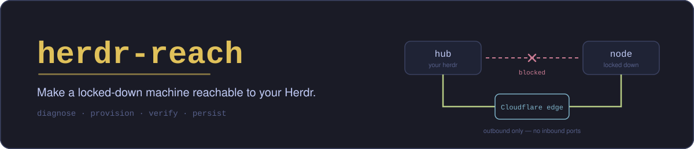
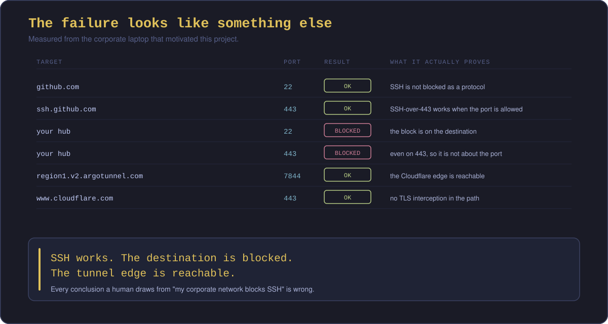
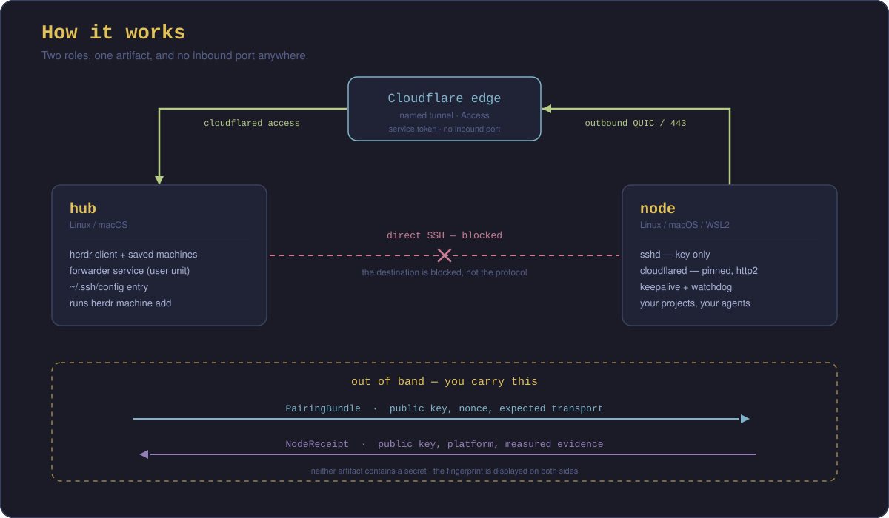

<!-- markdownlint-disable-next-line MD041 -->
<a id="top"></a>

<div align="center">



<h1>herdr-reach</h1>

<p><strong>Make a locked-down machine reachable to your Herdr.</strong></p>

<p>


<a href="LICENSE"></a>
</p>

<p>
<a href="PRD.md"><strong>PRD</strong></a> &bull;
<a href="#the-problem"><strong>The problem</strong></a> &bull;
<a href="#requirements"><strong>Requirements</strong></a> &bull;
<a href="#roadmap"><strong>Roadmap</strong></a>
</p>

<br/>

<p>
Every Herdr tool assumes SSH already works.
<strong>This one makes that true.</strong>
</p>

<p>
You have a work laptop with the company's repos, credentials and VPN access in it.
You have a hub that stays awake &mdash; a VPS, a home server, a Mac mini.
You want the agents on that laptop in the same Herdr sidebar as everything else.
<br/>
Your employer's network will never allow an inbound connection, and the usual
answer &mdash; a VPN mesh &mdash; is killed by the endpoint agent.
</p>

<p>
<strong>herdr-reach measures what your network actually allows, provisions the one
transport that will work, proves it works, and makes it survive reboots.</strong>
</p>

</div>

> [!IMPORTANT]
> **Status: beta, diagnosis only.** `herdr-reach doctor` ships in the
> [v0.1.0-beta.1 pre-release](https://github.com/Luisalt20/herdr-reach/releases): one read-only
> measurement run per invocation, which reports what your network allows and why a transport cannot
> work. **Everything else in this document is still planned** &mdash; pairing, provisioning,
> persistence, and the interface described below do not exist yet. [Beta testing](docs/beta-testing.md)
> covers what the shipped binary does and, just as deliberately, what it does not.

<div align="center"><sub>&middot; &middot; &middot;</sub></div>

## The problem

Herdr 0.9 shipped multi-machine: one client, several servers, one sidebar. It works over
SSH, and on machines you control it works immediately.

On a machine you *don't* control, it cannot work &mdash; and nothing on either end fixes
that. Corporate laptops behind FortiClient, Zscaler or Netskope; machines on CGNAT;
the work laptop whose outbound SSH is perfectly allowed but whose egress to *your*
server is blocked at the IP level.

The people who own those machines are exactly the people who want agents on them.

### The trap is that the failure looks like something it isn't

Ask a developer why their hub is unreachable and you will hear *"my corporate network
blocks SSH"*. Here is the same network, measured:



SSH works. The destination is blocked. The tunnel edge is reachable. **Every conclusion
a human draws from "my corporate network blocks SSH" is wrong**, and the wrong
conclusion sends you to the wrong transport.

<details>
<summary>The raw measurement, as a table</summary>

| Target | Port | Result | What it actually proves |
|:---|:---|:---|:---|
| `github.com` | 22 | **OK** | SSH is **not** blocked as a protocol |
| `ssh.github.com` | 443 | **OK** | SSH-over-443 works when the port is allowed |
| *your hub* | 22, 2222, 443 | **BLOCKED** | The block is on the **destination** |
| `region1.v2.argotunnel.com` | 7844 | **OK** | Cloudflare tunnel egress is allowed |
| `www.cloudflare.com` | 443 | **OK** | No TLS interception in the way |

</details>

### And then it gets worse

Having picked a transport, an ordinary setup still runs into all of this:

- **Cloudflare Quick Tunnels cannot carry SSH.** They are HTTP-only, so the free,
  no-account, no-domain path that works for other projects does not exist here.
- **A named tunnel needs a domain of your own** in a Cloudflare account &mdash; and a
  borrowed subdomain with a DNS record is *not* enough, as you will discover halfway
  through a favour from a friend.
- **`cloudflared` `2026.6.0` is reported to ignore service tokens** on `access ssh`
  ([#1673](https://github.com/cloudflare/cloudflared/issues/1673) &mdash; open, unlabelled and
  single-source), so a headless connection falls into a browser flow that can never complete.
- **Herdr added a Windows server only in 0.9.1**, and this tool does not provision a native Windows
  node yet &mdash; so the Windows path it handles is WSL2, and systemd services **do not** keep a
  WSL2 instance alive. Only children of Microsoft's `/init` do.
- **`vmIdleTimeout` defaults to 60 seconds** and is a second, independent shutdown.
- **Docker Desktop can take the whole VM down** when it quits, and you cannot stop it.
- **A correct key in the wrong file** produces a correct fingerprint, a silent failure,
  and an afternoon of debugging. It happened while this PRD was being written.

Each of those is an evening lost by a competent developer, for a reason that is not
their fault and is not documented anywhere in one place.

> **Premise note (2026-09-20).** The Herdr bullet above was true when it was written and is not any
> more: Herdr **0.9.1** (2026-09-16) added Windows SSH hosts, and on a Windows 11 24H2 host (build
> 26100) running 0.9.1, `herdr machine add` saved the connection and the hub listed the agents
> running natively on Windows. The trap was real when it was written; the premise changed underneath
> it. What remains true is this tool's limit: `herdr-reach` does not provision a native Windows node
> yet, so WSL2 stays the Windows path it handles.
>
> **Known limit.** The tool does not measure the node's Herdr version, so a node running Herdr older
> than 0.9.1 is refused here although it also cannot host a saved-machine connection. Telling those
> two cases apart needs a version measurement this tool does not make yet.

<div align="right"><a href="#top">Back to top</a></div>

<div align="center"><sub>&middot; &middot; &middot;</sub></div>

## What this is

The goal is a single interface: you tell it which of the two machines you are on, and it does the
rest. What ships today is the measurement that flow depends on &mdash; `herdr-reach doctor`, a headless
read-only run with no interface at all.



The result is the point: your work laptop's agents appear in the same Herdr sidebar as
everything else, with no inbound port opened on either machine and no VPN adapter for the
endpoint agent to kill.

Three things make it different from a setup script:

**1. Diagnose before choosing.** The transport is not a preference, it is a consequence
of measurement. Ten probes establish what the network permits, the tool recommends with
evidence, and **every rejected transport is listed with its reason.** Knowing that
`reverse-ssh` is impossible because your hub's port 22 is blocked is as valuable as
knowing what to do.

**2. Pair out of band, verify with fingerprints.** The two machines cannot reach each
other &mdash; that is the problem being solved &mdash; so the handoff is an artifact you
carry. Neither artifact contains a secret, and both sides display the fingerprint. Every
verification reports *what* **and** *where* (`owner user:user`, `mode 600`,
`/home/user/.ssh/authorized_keys`), because "the fingerprint matches" was never
sufficient evidence.

**3. Persist self-healing.** A tunnel that dies with the terminal is a demo. On Linux and
macOS it is a service. On WSL2 it is three layers &mdash; an idle-timeout setting, an
`/init`-child keepalive, and a watchdog that relaunches the environment when something
kills it. Verified by forcing a `wsl --shutdown`: **back in under 20 seconds, unassisted.**

## The environment that keeps trying to die

Most of this problem is a network problem. The part that is genuinely undocumented is what
happens on Windows.

Herdr supports a Windows server as of 0.9.1, but this tool does not provision a native Windows
node yet, so the Windows target it handles on a work laptop is WSL2. And WSL2 does not behave
like a machine &mdash; it behaves like a VM trying to shut itself down, through three mechanisms
that have nothing to do with each other:


The counter-intuitive part, and the reason this took a measurement instead of a doc read:
**systemd services do not keep a WSL2 instance alive.** A perfectly healthy `sshd` running
as a systemd unit does not count. Only children of Microsoft's `/init` do. That one fact is
why the failure looks like a network fault, and why every guide that says "just enable
systemd" is wrong.

So persistence takes three layers, and the result was not assumed &mdash; it was measured:

- **Layer 1** &mdash; `vmIdleTimeout=-1`. Documented, real, and only one of three.
- **Layer 2** &mdash; a keepalive that is a genuine child of `/init`, and **dumb by design**.
  Making it do real work would turn its failure into a total outage of the instance.
- **Layer 3** &mdash; a watchdog, because it also has to survive being killed on purpose by a
  user, an update, or another application.

Then we forced a `wsl --shutdown` and watched. Killed, relaunched, services up, tunnel back:
**20 seconds, unassisted.**

That is the difference between a demo and a tool.

## What this is not

- **Not a new transport.** It composes proven ones: Cloudflare Tunnel, plain SSH, reverse
  SSH. Nothing new is invented and nothing is patched.
- **Not a dashboard.** Viewing agents from your phone is solved by projects that do it
  better. They show your machines; this one makes them reachable.
- **Not an orchestration runtime.** Herdr owns panes, sessions and agents. This never
  touches them, and it never patches the `herdr` binary &mdash; only its public CLI.
- **Not Herdr Cloud.** No account, no backend, no server of ours anywhere in the path.
- **Not for two personal machines on one network.** `herdr machine add` already works
  there. Adding a tunnel would be a regression.

<div align="right"><a href="#top">Back to top</a></div>

<div align="center"><sub>&middot; &middot; &middot;</sub></div>

## Where this fits, and what Herdr Cloud changes

Herdr's roadmap says the connectivity problem should be solved by **Herdr Cloud**: *"you
shouldn't need to think about SSH or deal with complicated network setup."* Taken at face
value, that overlaps with the transport half of this tool, and pretending otherwise would
be dishonest.

Here is the honest read.

**If Herdr Cloud ships and works behind a corporate endpoint agent**, then for many users
the "connect this machine" step becomes one command, and provisioning a tunnel by hand
stops being necessary. That is a good outcome and it is not something to root against.

**What stays true regardless:**

| | Why it survives |
|:---|:---|
| **Corporate policy** | Routing a work machine's terminal traffic through a vendor's cloud is what a security review rejects. A tunnel to a **domain the company or the employee controls**, in an account that can be audited and revoked, is a different conversation. That constraint is organisational, not technical, and it is *the* dominant one in exactly the environment this tool targets. |
| **Self-hosting by principle** | Some people will not route through a third party even when it works, and some machines are not allowed to. Owning the path is the point, not a temporary workaround. |
| **Diagnosis** | "Why can't this machine connect?" remains unanswered by any transport. `herdr-reach doctor` answers it, and it is transport-independent. |
| **The traps** | A pinned `cloudflared`, a silent QUIC fallback, and WSL2's lifetime problem exist in **any** transport &mdash; including a Herdr Cloud agent running on WSL2. That knowledge lives in this tool's environment layer, not in the transport layer. |
| **Not shipped yet** | Herdr Cloud is a waitlist on a pre-1.0 product. Depending on it is a bet. Having a path you own today is not. |

**And the part that matters architecturally:** if Herdr Cloud ships and is viable behind
firewalls, **it becomes a transport adapter.** That is what the `Transport` interface
exists for. This tool does not compete on the transport &mdash; it measures, chooses,
provisions and verifies *whichever* transport is viable, including upstream's. The same
applies to Microsoft Dev Tunnels, which needs no domain and is already on the roadmap.

> **The gap is not the tunnel. The gap is knowing which tunnel is possible from here,
> and proving that it works.**

<div align="right"><a href="#top">Back to top</a></div>

<div align="center"><sub>&middot; &middot; &middot;</sub></div>

## Requirements

`herdr-reach` automates everything it can. This section is the honest list of what it
**cannot** create for you, because those are the things that decide whether the project
works at all.

### You must provide: a hub that stays online

| | |
|:---|:---|
| **What** | A machine that is online when you want to reach your node. A VPS, a home server, a Mac mini. |
| **OS** | Linux or macOS. Herdr's multi-machine client does not support Windows. |
| **Why** | The Herdr client, the forwarder service and the SSH config all live here. |
| **Cost** | Whatever your hub already costs. A small VPS is enough. |

### You must provide: a hostname on a domain in a Cloudflare account

This is the one real prerequisite, and the one that surprises people.

| Requirement | Why | Cost |
|:---|:---|:---|
| **A domain you can add to Cloudflare** | A Cloudflare Tunnel can only publish a `tcp://` or `ssh://` service on a **hostname inside a zone you control**. Quick Tunnels (`trycloudflare.com`) are HTTP-only and cannot carry SSH, so there is no free-account shortcut for this. | a domain, typically ~$10/yr |
| **A Cloudflare account** | Holds the tunnel, the DNS route and the Access application. | free |
| **A Cloudflare Zero Trust organization** | Access policies and service tokens live there. | free (up to 50 users) |
| **The specific thing:** permission to create a tunnel **and** edit DNS | Creating a tunnel is an account-level action; editing DNS is zone-level. Both are required. | free |

**Borrowing a subdomain?** A DNS record alone is **not** enough &mdash; the tunnel has to
live in the account that owns the zone. Two arrangements work:

1. The zone owner **invites you as a member** of their Cloudflare account, with permission
   to create tunnels and edit DNS for that zone. You then create everything yourself.
2. The zone owner **delegates the subdomain by NS records** to your own Cloudflare account,
   which you then add as a zone.

A third path also works and needs nothing from you beyond consent: the zone owner creates
the tunnel, the route and the service token in *their* dashboard and hands you the
credentials. `herdr-reach` documents exactly what to ask for, in copy-pasteable form.

> **Your traffic stays yours in all three cases.** The payload is an SSH session, encrypted
> end to end. Cloudflare terminates the tunnel, not the session, and the zone owner can
> revoke access but cannot read content.

### Your network must allow

| Check | Needed | Notes |
|:---|:---|:---|
| TCP to `region1.v2.argotunnel.com` | **yes** | port `7844` preferred, `443` also works |
| UDP/QUIC to the same hosts | optional | if blocked, HTTP/2 is forced automatically |
| TLS to the Cloudflare edge, unmodified | **yes** | if something inspects TLS, its CA must be in the trust store |
| Outbound internet from the node | **yes** | the node never accepts an inbound connection |

> **Slice-scope note (2026-09-19).** "forced automatically" is the product's behaviour. Slice R1a only
> measures and recommends: it reports UDP/QUIC silence as unresolved rather than as a block, and it never
> claims a fallback was applied. Forcing the protocol belongs to R5.

All of these are measured for you. If one fails, you get the verdict and the reason, not a
generic error.

### Your machines must be

| Role | Supported | Notes |
|:---|:---|:---|
| **Hub** | Linux, macOS | Herdr's client only |
| **Node** | Linux, macOS | needs `systemd` or `launchd` |
| **Node** | **Windows with WSL2** | **supported.** WSL2 is the Windows path this tool handles today, including its lifetime problem. Herdr supports a Windows server as of 0.9.1, but this tool does not provision a native Windows node yet. |
| **Node** | native Windows | **not provisioned by this tool yet.** Herdr supports a Windows server as of 0.9.1; the missing piece is this tool's provisioning slice. |

### Before you use this on a machine you do not own

> **Read this part.**
>
> `herdr-reach` creates an outbound path from a machine into infrastructure you control.
> On a machine administered by your employer, that may violate policy &mdash; FortiClient
> and its peers exist partly to prevent exactly this, and an endpoint agent may detect it.
>
> This is a deliberate choice you make for your own machine, not one a tool should make for
> you. Get authorisation from your IT department, or run this on machines you own.
>
> The tool never hides itself, never disables other software to protect itself, and
> `herdr-reach remove` tells you exactly what it created and what it will not touch.

<div align="right"><a href="#top">Back to top</a></div>

<div align="center"><sub>&middot; &middot; &middot;</sub></div>

## How you will use it

**Two roles, two flows, one artifact between them.** Only `doctor` exists today; every other command
below is planned.

```bash
herdr-reach              # asks which machine this is, then does the work    (planned)
herdr-reach doctor       # read-only diagnosis of THIS machine              (ships)
herdr-reach status       # probe freshness, tunnel health, service state    (planned)
herdr-reach verify workbox                                                  (planned)
herdr-reach remove workbox                                                  (planned)
```

The node side measures first and changes nothing until you approve a plan:

```
Step 1: Diagnosing          your network, measured, with raw results
Step 2: Verdict             the transport to use, and why the others cannot
Step 3: What needs a human  the hostname only you can provide
Step 4: Plan                every file to be touched, before touching it
Step 5: Verifying           evidence, with owner, mode and path
Step 6: Receipt             one public artifact for your hub
```

Every plan supports dry-run, every modified file is backed up, and every step can be
undone. Nothing in this tool changes a system as a side effect of thinking about it.

<div align="right"><a href="#top">Back to top</a></div>

<div align="center"><sub>&middot; &middot; &middot;</sub></div>

## Install

**The diagnosis slice is available as a pre-release.**
[`v0.1.0-beta.1`](https://github.com/Luisalt20/herdr-reach/releases) attaches one binary per platform
plus a `SHA256SUMS` file. Verify the bytes and the build before you run it &mdash;
[Beta testing](docs/beta-testing.md) walks through both, and through the two profiles the run is
meant for.

Package managers are planned, not available:

```bash
# macOS (Homebrew)                                                      (planned)
brew install Luisalt20/tap/herdr-reach

# macOS / Linux (curl)                                                  (planned)
curl -fsSL https://raw.githubusercontent.com/Luisalt20/herdr-reach/main/scripts/install.sh | bash

# Any platform with Go 1.25.10+ — name the tag: a pre-release is never @latest
go install github.com/Luisalt20/herdr-reach/cmd/herdr-reach@v0.1.0-beta.1
```

Building from source will need only Go &mdash; the runtime dependencies are `ssh`, `sshd`,
`cloudflared` and your service manager, all of which the tool checks for and tells you
about by name.

<div align="right"><a href="#top">Back to top</a></div>

<div align="center"><sub>&middot; &middot; &middot;</sub></div>

## Related projects

Every one of these does something this tool deliberately does not. All of them assume the
machine is already reachable &mdash; which is the assumption `herdr-reach` exists to make
true.

| Project | What it does | Assumes SSH |
|:---|:---|:---|
| [`stfl/herdr-bridge`](https://github.com/stfl/herdr-bridge) | One remote agent in one local pane | ✅ |
| [`ofogelin/herdr-mirror`](https://github.com/ofogelin/herdr-mirror) | Mirror remote workspaces into the local sidebar | ✅ |
| [`Poor-Plebs/herdr-remote-panes`](https://github.com/Poor-Plebs/herdr-remote-panes) | Remote terminals from a menu, read from `~/.ssh/config` | ✅ |
| [`dcolinmorgan/herdr-remote`](https://github.com/dcolinmorgan/herdr-remote) | Human dashboard over HTTP (menu bar, phone, Telegram) | ✅ |
| [`Tomyail/herdr-connect`](https://github.com/Tomyail/herdr-connect) | LAN companion app for a phone | ✅ same LAN |
| [Herdr 0.9](https://herdr.dev/docs/connecting-machines/) | Native multi-machine | ✅ by design |

**This tool's output &mdash; *"SSH to `workbox` now works, and here is the proof"*** &mdash;
is the input those projects already expect. It does not replace them; it feeds them.

<div align="right"><a href="#top">Back to top</a></div>

<div align="center"><sub>&middot; &middot; &middot;</sub></div>

## Roadmap

The full specification is in the [PRD](PRD.md). This is the order of attack.

| Phase | Scope | Notes |
|:---|:---|:---|
| **0. Design** | This document and the [PRD](PRD.md) | ← you are here |
| **1. Diagnosis** | `herdr-reach doctor`: the probe suite, `--json`, no mutations | Everything else depends on being able to measure. Ships first, and is useful on its own. |
| **2. Cloudflare transport** | The node flow, the hub flow, pairing artifacts | The transport that motivated the project |
| **3. Persistence** | Linux/systemd, macOS/launchd, **WSL2 keepalive + watchdog** | The WSL2 work is the differentiator and the least documented anywhere |
| **4. Direct paths** | `direct-ssh`, `reverse-ssh` as first-class options | Cheaper than a tunnel when the network permits it. Try the cheap path first. |
| **5. Dev Tunnels** | A transport that needs no domain | Removes the single biggest prerequisite in this README |
| **6. Recipes** | Export and import a solved network profile | For teams on the same corporate image |

**Not in scope, by decision:** a dashboard, a proxy implementation, a hosted service, a
Herdr patch, native Windows as a node.

<div align="right"><a href="#top">Back to top</a></div>

<div align="center"><sub>&middot; &middot; &middot;</sub></div>

## Design principles

Four rules that decide arguments in this codebase.

1. **Measure, then recommend.** Never guess a transport. A recommendation without a
   reason attached is a bug.
2. **`indeterminate` is never `pass`.** When the tool cannot establish something, it says
   so and says why. No fabricated success, ever.
3. **A probe that cannot fail is not a probe.** Every check carries a control. Verifying
   content also means verifying location.
4. **Never win by deletion.** The tool does not disable your other software to protect
   itself. If Docker Desktop can kill the environment, the answer is a watchdog, not an
   uninstall.

<div align="right"><a href="#top">Back to top</a></div>

<div align="center"><sub>&middot; &middot; &middot;</sub></div>

## About the author

Built by **Luisalt20** &mdash; out of necessity, on a work laptop that could not be reached
and a VPS that could.

The whole design comes from one rule learned the hard way while solving this by hand:
**verifying beats assuming.** Every trap documented here was hit first, measured second,
and understood third.

<!-- TODO: add website / social links here when available -->

---

<div align="center">

<h3>herdr-reach makes the machines reachable.<br/>Herdr makes them yours.</h3>

<br/>

<a href="LICENSE"></a>

</div>
